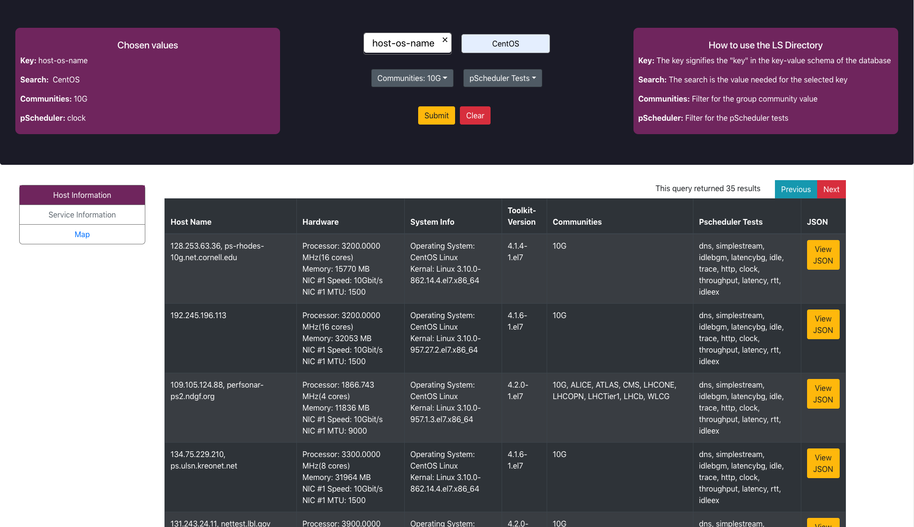
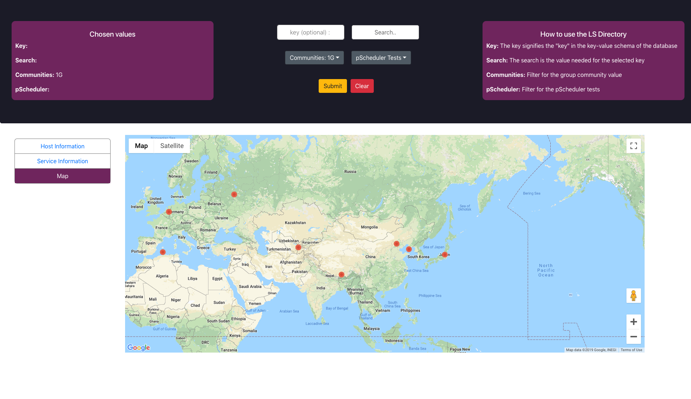

# Lookup Service Directory

## About

Complete redesign for the current LookupService Direcotry UI as well as back-end database - http://stats.es.net/ServicesDirectory/

## Changes

* Backend Database
  * Bakcend database now uses ElasticSearch rather than MongoDB.
* API
  * API is now converted from Python using flask to Java using spring-boot
* Front End
  * Front End now uses React-Js
  
## Software Versions

* Java - 12.0.1
* Node - 10.16.2
* SpringBoot - 2.1.7
* ElasticSearch - 7.2.0

## Building and Running

i. mvn clean install

ii. mvn spring-boot:run

iii. Runs on localhost:8080

## Deploy

java -jar target/Spring-Boot-React-0.0.1-SNAPSHOT.jar

## Images

Searching in the Dashboard

Viewing the map in the dashboard

